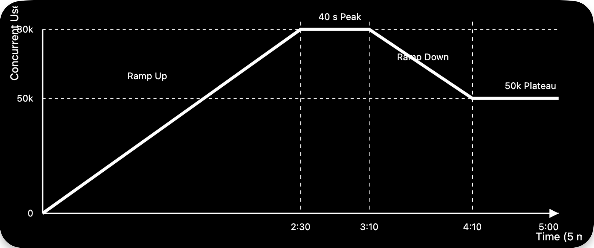

# ADR-020: Standardize the 1M MAU Benchmark Load Profile | Locust to generate traffic

**Status:** Accepted

**Date:** 2026-09-11

## Context

The platform demonstrates production-grade scalability through a reproducible benchmark rather than ad-hoc load testing. A standardized load profile and traffic generation tool ensure consistent execution, comparable results, and repeatable verification artifacts across future benchmark runs.

## Decision

Adopt a fixed **1M MAU benchmark profile** executed over a **5-minute demonstration**, and use **Locust** as the standardized traffic generation tool.

- **Benchmark Controller Service** orchestrates benchmark execution.
- **Locust-based Load Generator** generates HTTPS traffic against the API Gateway.
- GKE autoscaling and Cloud Service Mesh operate under production-like conditions.
- Infrastructure and AI telemetry are collected throughout the benchmark.
- The benchmark produces reproducible verification artifacts and a replayable five-minute demonstration.

## Benchmark Assumptions

| Metric | Value | Notes |
|--------|------:|------|
| MAU | 1.0 million | Baseline target |
| DAU | 400,000 | 40% of MAU |
| Peak Concurrent Users | 80,000 | 20% of DAU |
| Requests/User/Minute | 3 | Assumption |
| Peak Hour Requests | 14.4 million | Derived |
| Peak RPS | 4,000 | Maximum sustained |
| Demo Duration | 5 minutes | Standard benchmark |
| Requests During Demo | 780,000 | Calculated total (as shown in [Load Distribution](#load-distribution)) |

### Cloud-Native Scalability

- The current cloud-native architecture is designed to scale beyond the validated **1M MAU** benchmark to **100M MAU** without requiring a fundamental redesign of the application or microservice architecture, as Kubernetes can horizontally scale stateless services using the same deployment model. 
- Scaling toward **100M MAU** would primarily require expanding infrastructure capacity—such as database throughput, Valkey and pgvector sharding, GPU inference capacity, network bandwidth, load balancer limits, and cloud quotas—rather than changing the overall architecture. 
- The benchmark is standardized at **1M MAU** because it provides a realistic, reproducible, and cost-effective demonstration (approximately **$50.70** for managed LLM inference) while larger-scale benchmarks would incur significantly higher infrastructure costs.

## Standard Load Profile

| Phase | Time | Users | RPS | Behavior |
|------|------|------:|----:|---------|
| Ramp Up | 0:00–2:30 | 0 → 80k | 0 → 4,000 | ~534 users/sec |
| Peak Hold | 2:30–3:10 | 80k | 4,000 | Hold peak load |
| Ramp Down | 3:10–4:10 | 80k → 50k | 4,000 → 2,500 | Gradual decline |
| Plateau | 4:10–5:00 | 50k | 2,500 | Stable load |

## Load Distribution

| Phase | User-Seconds | Requests |
|------|-------------:|---------:|
| Ramp Up | 6,000,000 | 300,000 |
| Peak Hold | 3,200,000 | 160,000 |
| Ramp Down | 3,900,000 | 195,000 |
| Plateau | 2,500,000 | 125,000 |
| **Total** | **15,600,000** | **780,000** |

## Verification Artifacts

- Throughput (RPS)
- Latency (P50, P95, P99)
- Error rate
- Autoscaling timeline
- CPU and memory utilization
- Distributed trace summary
- Infrastructure and AI cost summary
- Five-minute benchmark replay

## Consequences

### Advantages

- Produces reproducible benchmark results.
- Validates autoscaling under realistic peak traffic.
- Standardizes performance comparisons across releases.
- Leverages Locust's distributed load generation for high-concurrency testing.
- Generates portfolio-ready verification artifacts.

### Trade-offs

- Large-scale executions incur infrastructure and inference costs.

## Alternatives Considered

| Alternative | Reason Rejected |
|------------|-----------------|
| k6 | Rejected because Locust provides greater flexibility through Python-based user behavior modeling, distributed worker orchestration, and easier customization for complex multi-step research workflows. |

## Related ADRs

- ADR-002: Use Google Kubernetes Engine (GKE)
- ADR-003: Use Cloud Service Mesh (Istio-based)
- ADR-016: Benchmark the Platform Using Simulated Traffic up to 1M MAU
- ADR-019: Use Managed LLM API Instead of Self-Hosted LLM