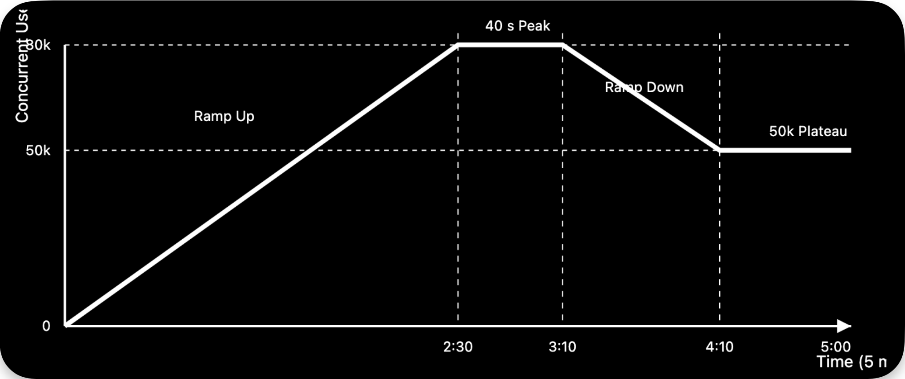

---

id: RKB-BENCH-001
title: Load Generation
bundle: benchmark
version: 1.0.0
status: approved
owner: Platform
last_updated: 2026-09-26
tags:

- benchmark
- load
- 1m-mau

---

# Load Generation

## Purpose

Define the assumptions, calculations, and load profile used to validate the platform's **1 Million Monthly Active User (1 MAU)** benchmark.

## Benchmark Assumptions

| Metric                       |      Value | Notes                 |
| ---------------------------- | ---------: | --------------------- |
| Monthly Active Users (MAU)   |  1,000,000 | Target benchmark      |
| Daily Active Users (DAU)     |    400,000 | 40% of MAU            |
| Peak Concurrent Users        |     80,000 | 20% of DAU            |
| Requests per User per Minute |          3 | Average user behavior |
| Delay Between Requests       | 20 seconds | Simulated user pacing |
| Peak Requests per Second     |      4,000 | Maximum target RPS    |

## Five-Minute Demonstration Mapping

The recorded benchmark replay showcases the platform operating under a realistic peak-load scenario derived from the 1 MAU assumptions. Rather than sustaining peak load for the full duration, the replay demonstrates controlled ramp-up, peak traffic, and scale-down behavior across the microservice architecture. This demonstrates the architecture’s ability to absorb peak traffic, scale efficiently under load, and maintain stable performance throughout the load cycle.

| Demonstration Metric  | Value     |
| --------------------- | --------- |
| Duration              | 5 minutes |
| Peak Concurrent Users | 80,000    |
| Peak Requests per Second | 4,000 |
| Total Requests Processed | 780,000 |
| Load Pattern | Ramp Up → Peak Hold → Ramp Down → Plateau |

## Load Profile

| Phase     | Time            |           Users |           RPS | Ramp            |
| --------- | --------------- | --------------: | ------------: | --------------- |
| Ramp Up   | 0:00–2:30 (150s) |      0 → 80,000 |     0 → 4,000 | ~534 users/sec  |
| Peak Hold | 2:30–3:10 (40s)  |          80,000 |         4,000 | Hold            |
| Ramp Down | 3:10–4:10 (60s)  | 80,000 → 50,000 | 4,000 → 2,500 | Gradual decline |
| Plateau   | 4:10–5:00 (50s)  |          50,000 |         2,500 | Hold            |

## Requests by Phase

| Phase     |   User-Seconds |    Requests |
| --------- | -------------: | ----------: |
| Ramp Up   |      6,000,000 |     300,000 |
| Peak Hold |      3,200,000 |     160,000 |
| Ramp Down |      3,900,000 |     195,000 |
| Plateau   |      2,500,000 |     125,000 |
| **Total** | **15,600,000** | **780,000** |

## Load Profile Visualization

The benchmark replay follows the predefined load profile illustrated below.

## Benchmark Rationale

The replay demonstrates a realistic peak-load scenario derived from the platform's **1 MAU** assumptions by gradually ramping users, sustaining peak traffic, and validating behavior during controlled scale-down. This approach provides reproducible benchmark evidence while preserving realistic request patterns across the platform's event-driven microservice architecture.

## Scaling Beyond 100 Million MAU

The architecture is designed to scale beyond 100 Million Monthly Active Users (100M MAU) without requiring fundamental architectural changes. The same event-driven microservice architecture, independent service scaling, and stateless execution model remain applicable as traffic grows. Scaling primarily becomes an infrastructure and capacity planning exercise.

The key scaling considerations are:

| Scaling Factor | Primary Focus | Details |
| --------------- | ------------- | ------------- |
| LLM Capacity | GPU availability and inference throughput | Increase inference capacity through additional GPUs, higher concurrency, model optimization, or multiple inference endpoints. |
| PostgreSQL + pgvector | Write throughput and sharding strategy | Increase write throughput through partitioning and sharding, optimize indexes, and distribute vector workloads across multiple database nodes. |
| Pub/Sub | Message throughput | Increase message throughput by scaling subscribers horizontally, processing messages in parallel, and separating high-volume topics to prevent bottlenecks. |
| Network | Internal bandwidth and load balancing | Increase internal bandwidth with regional load balancing, sufficient VPC capacity, and optimized cross-service traffic to prevent network saturation. |

## Related Documents

* [Capacity Validation Benchmark](../workflows/capacity_validation_benchmark.md)
* [Performance Requirements](../requirements/performance.md)
* [Scalability Requirements](../requirements/scalability.md)
